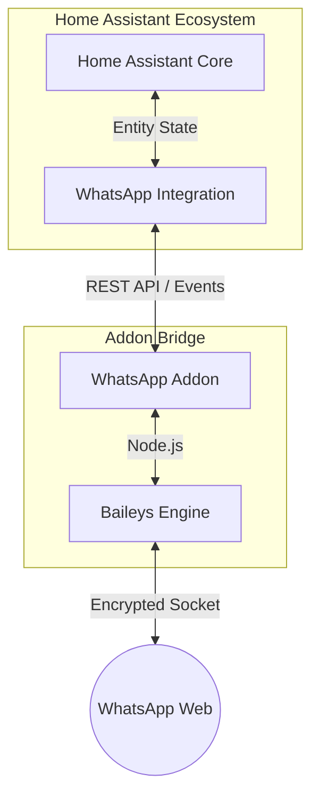

# 📱 HA WhatsApp Integration

Welcome to the official documentation for the **Home Assistant WhatsApp Integration**. This project provides a robust, real-time bridge between Home Assistant and WhatsApp, allowing you to send notifications, manage interactive buttons, create polls, and build powerful WhatsApp-based bots.

---

## 🏗️ Architecture

This project consists of two main components working together:

1.  **[WhatsApp Addon](https://github.com/FaserF/hassio-addons/tree/main/whatsapp)**: A Node.js server (running Baileys) that handles the actual WhatsApp Web connection and provides a REST API.
2.  **[WhatsApp Custom Integration](https://github.com/FaserF/ha-whatsapp)** (This Repo): the Home Assistant component that connects to the addon and exposes sensors, notify entities, and services.

> [!NOTE]
> **Privacy First**: This integration processes all data locally. Your messages never leave your private network except when being sent to WhatsApp's official servers.

## 🚀 Key Features

- **Standardized Notifications**: Fully compatible with the modern Home Assistant `notify` service.
- **Interactive Elements**: Support for **Buttons**, **Polls**, and **Reactions**.
- **Media Support**: Send images, snapshots, and locations.
- **Real-time Events**: Receive messages directly in Home Assistant as events for powerful bot automations.
- **Auto-Discovery**: Support for mDNS discovery for effortless setup.

---

## 🏁 Getting Started

If you are new here, follow these steps in order:

1.  Read the **[Installation Guide](installation.md)** to set up the addon and integration.
2.  Explore the **[Service Documentation](services.md)** to learn how to send messages.
3.  Check out **[Advanced Automations](automations.md)** to build your first WhatsApp bot.
4.  Understand the **[Architecture & Why](architecture.md)** behind the addon+integration bridge.
5.  Read the **[Limitations & Warnings](limitations.md)** to ensure stable usage.
6.  Look at **[Pro-Tips & Tricks](tips.md)** for troubleshooting and hidden features.

---

*Maintained by [FaserF](https://github.com/FaserF)*.

> [!NOTE]
> This project is not affiliated, associated, authorized, endorsed by, or in any way officially connected with WhatsApp Inc. or any of its subsidiaries or its affiliates.
