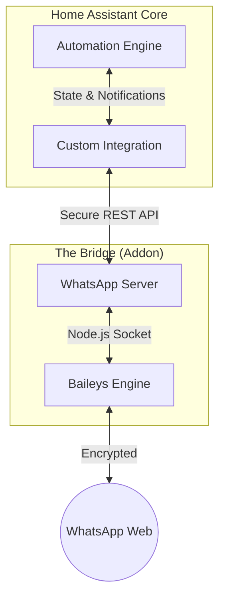

  
  <h1>WhatsApp for HA</h1>
  
The most robust, private, and localized WhatsApp integration for Home Assistant. Connect your automations to the world's most popular messaging platform.

---

| Component | Version | Status |
| :--- | :--- | :--- |
| **Addon (Stable)** |  | engine |
| **Addon (Edge)** |  | engine-dev |
| **Integration (Stable)** |  | interface |
| **Integration (Beta)** |  | testing |
| **Activity** |  | |

---

  

    <a href="installation.html" class="btn btn-green" style="padding: 12px 24px; font-weight: bold;">🚀 Get Started</a>
  

  

    
  

  

    <a href="https://github.com/FaserF/ha-whatsapp" class="btn btn-outline">Integration Repo</a>
    <a href="https://github.com/FaserF/hassio-addons" class="btn btn-outline">Addon Repo</a>
  

> **Legal Disclaimer / Haftungsausschluss**
>
> Using automated messaging on WhatsApp may violate their **[Terms of Service](https://www.whatsapp.com/legal/terms-of-service/)** and lead to a **permanent account ban**.
> The developers of this project assume no liability for any blocked or banned accounts. Use at your own risk.
>
> Official Policy: **[WhatsApp Terms of Service](https://www.whatsapp.com/legal/terms-of-service/)**
{: .important }

## 🏗️ Technical Architecture

This project is built for performance and absolute privacy.

> **Privacy First**: Your WhatsApp connection is local. No external servers (other than WhatsApp's official ones) ever see your message content.
{: .important }

---

## 🔥 Why choose this integration?

- **Real-time**: Near-zero latency for incoming and outgoing messages.
- **Modern**: Fully supports the 2026 Home Assistant `notify` standards.
- **Rich Content**: Interactive Buttons, Polls, Reactions, and Media support.
- **Localized**: Deep German (DE) and English (EN) support.

---

*Maintained by [FaserF](https://github.com/FaserF)*.

> This project is not affiliated, associated, authorized, endorsed by, or in any way officially connected with WhatsApp Inc. or any of its subsidiaries or its affiliates.
{: .note }
