  
  <h1>WhatsApp for HA</h1>
  
The most robust, private, and localized WhatsApp integration for Home Assistant. Connect your automations to the world's most popular messaging platform.

  

    <table style="width: 100%; border-collapse: collapse; background: rgba(255, 255, 255, 0.02); border-radius: 12px; overflow: hidden; border: 1px solid var(--wa-border);">
      <thead>
        <tr style="background: rgba(37, 211, 102, 0.1);">
          <th style="padding: 12px; text-align: left; border-bottom: 2px solid var(--wa-border);">Component</th>
          <th style="padding: 12px; text-align: left; border-bottom: 2px solid var(--wa-border);">Version</th>
          <th style="padding: 12px; text-align: left; border-bottom: 2px solid var(--wa-border);">Status</th>
        </tr>
      </thead>
      <tbody>
        <tr>
          <td style="padding: 12px; border-bottom: 1px solid var(--wa-border);"><strong>App (Stable)</strong></td>
          <td style="padding: 12px; border-bottom: 1px solid var(--wa-border);">
            
          </td>
          <td style="padding: 12px; border-bottom: 1px solid var(--wa-border);">engine</td>
        </tr>
        <tr>
          <td style="padding: 12px; border-bottom: 1px solid var(--wa-border);"><strong>App (Edge)</strong></td>
          <td style="padding: 12px; border-bottom: 1px solid var(--wa-border);">
            
          </td>
          <td style="padding: 12px; border-bottom: 1px solid var(--wa-border);">engine-dev</td>
        </tr>
        <tr>
          <td style="padding: 12px; border-bottom: 1px solid var(--wa-border);"><strong>Integration (Stable)</strong></td>
          <td style="padding: 12px; border-bottom: 1px solid var(--wa-border);">
            
          </td>
          <td style="padding: 12px; border-bottom: 1px solid var(--wa-border);">interface</td>
        </tr>
        <tr>
          <td style="padding: 12px; border-bottom: 1px solid var(--wa-border);"><strong>Integration (Beta)</strong></td>
          <td style="padding: 12px; border-bottom: 1px solid var(--wa-border);">
            
          </td>
          <td style="padding: 12px; border-bottom: 1px solid var(--wa-border);">testing</td>
        </tr>
        <tr>
          <td style="padding: 12px;"><strong>Activity</strong></td>
          <td style="padding: 12px;">
            
          </td>
          <td></td>
        </tr>
      </tbody>
    </table>
  

  

    <a href="installation.html" class="btn btn-green" style="padding: 12px 24px; font-weight: bold;">🚀 Get Started</a>
  

  

    <a href="https://my.home-assistant.io/redirect/config_flow/?domain=whatsapp" target="_blank" class="btn-myha"><svg style="width:24px;height:24px" viewBox="0 0 24 24"><path d="M12,4L2,11V22h20V11M12,5.84L20,11.44V20.5H15V15.5A3,3 0 0,0 12,12.5A3,3 0 0,0 9,15.5V20.5H4V11.44L12,5.84Z" fill="white" /></svg>Add Integration</a>
  

  

    <a href="https://github.com/FaserF/ha-whatsapp" class="btn btn-outline">Integration Repo</a>
    <a href="https://github.com/FaserF/hassio-addons" class="btn btn-outline">App Repo</a>
  

## 🔗 Webhook Integration

Forward your WhatsApp messages to any HTTP endpoint in real-time. This project isn't just for Home Assistant; you can use the built-in Webhook to bridge WhatsApp to:

- **Node-RED** for complex automation flows.
- **Generic HTTP Servers** (Python, Node.js, PHP, etc.) for logging or custom bots.
- **Unified Chat Platforms** like Rocket.Chat or Slack.

[View the Webhook Guide](webhooks.html)
{: .btn .btn-outline }

> **Legal Disclaimer / Haftungsausschluss**
>
> Using automated messaging on WhatsApp may violate their **[Terms of Service](https://www.whatsapp.com/legal/terms-of-service/)** and lead to a **permanent account ban**.
> The developers of this project assume no liability for any blocked or banned accounts. Use at your own risk.
>
> Official Policy: **[WhatsApp Terms of Service](https://www.whatsapp.com/legal/terms-of-service/)**
> {: .important }

## 🏗️ Technical Architecture

This project is built for performance and absolute privacy.

```mermaid
graph TD
    %% Define Styles
    classDef wa fill:#25D366,stroke:#075E54,stroke-width:2px,color:#fff,font-weight:bold;
    classDef ha fill:#111b21,stroke:#25D366,stroke-width:1px,color:#e9edef;
    classDef logic fill:#128C7E,stroke:#075E54,stroke-width:1px,color:#fff;
    classDef network fill:#000,stroke:#25D366,stroke-width:1px,dasharray: 5 5;

    subgraph UserInterface ["User Layer"]
        User((User))
        HA_UI[HA Dashboard]
    end

    subgraph HACore ["Home Assistant Core"]
        direction TB
        WH[WhatsApp Integration]
        Core[Automation Engine]
        Notify[Notify Service]
    end

    subgraph AppBridge ["App Architecture (Local)"]
        direction TB
        API[Express API Server]
        BL[Baileys Node.js Engine]
        Auth[Local Auth Session]
    end

    subgraph External ["WhatsApp Cloud"]
        WA[WhatsApp Servers]
    end

    %% Flows
    User <-->|Control & Status| HA_UI
    HA_UI <-->|Web Interface| Core
    Core <-->|Triggers| WH
    Notify -->|Send Message| WH
    WH <-->|REST API :8066| API
    API <-->|Local Events| BL
    BL <-->|Persistent Session| Auth
    BL <-->|Websocket / MD| WA
    WA <-->|End-to-End Encrypted| Recipient((Phone))

    %% Assign Styles
    class WA,User,Recipient wa;
    class WH,Core,Notify,API,Auth ha;
    class BL logic;
    class External network;
```

> **Privacy First**: Your WhatsApp connection is local. No external servers (other than WhatsApp's official ones) ever see your message content.
> {: .important }
>
> > **Tip:**
> **Want to use Rocket.Chat?** Check out our [Rocket.Chat Bridge Guide](rocketchat.md) to connect WhatsApp to your team workspace!

## 🏷️ Versions

- **Stable**: Production-ready. Follows semantic versioning (e.g., `v1.0.1`).
- **Beta**: Feature-complete testing versions (e.g., `v1.0.1b0`). [See Installation Guide](beta.html).
- **Nightly/Dev**: Experimental builds from the latest code (e.g., `v1.0.2-dev`).

---

## 🔥 Why choose this integration?

- **💡 [Tips & Tricks](tips.md)**: Optimize your experience.
- **💬 [Rocket.Chat Bridge](rocketchat.md)**: Connect WhatsApp to your team chat.
- **🔗 [Webhook Support](webhooks.md)**: Forward messages to any external service.
- **📜 [API Documentation](api.html)**: For developers and advanced users.
- **Real-time**: Near-zero latency for incoming and outgoing messages.
- **Modern**: Fully supports the 2026 Home Assistant `notify` standards.
- **Rich Content**: Interactive Buttons, Polls, Reactions, and Media support.
- **Easy Setup**: Automatic Add-on installation and configuration for Home Assistant OS users.
- **Localized**: Deep German (DE) and English (EN) support.

---

_Maintained by [FaserF](https://github.com/FaserF)_.

> This project is not affiliated, associated, authorized, endorsed by, or in any way officially connected with WhatsApp Inc. or any of its subsidiaries or its affiliates.
> {: .note }
