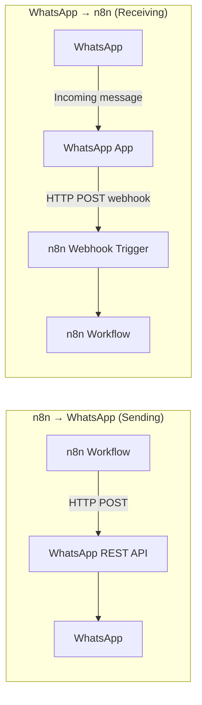

# 🔄 n8n Integration

This guide shows you how to integrate **ha-whatsapp** with [n8n](https://n8n.io/) — without any native node required.

> **No native n8n node exists** for ha-whatsapp, and none is planned in the near future due to the significant maintenance effort involved in publishing and maintaining a community node package. However, the full REST API and Webhook system give you **everything you need** to build powerful WhatsApp automations directly in n8n using the built-in **HTTP Request** node.

---

## 🏗️ Architecture Overview

There are two integration directions:

| Direction | Mechanism | Use case |
|---|---|---|
| **n8n → WhatsApp** | REST API (`HTTP Request` node) | Send messages, media, polls, etc. triggered by n8n |
| **WhatsApp → n8n** | Webhook push | React to incoming WhatsApp messages in n8n |

---

## 🔐 Authentication

All REST API requests require the `X-Auth-Token` header.

1. Open the **WhatsApp App Web UI** (port `8066` by default).
2. Copy the **API Token** from the dashboard.
3. In n8n, store it as a **Credential** → `Header Auth`:
   - **Name**: `X-Auth-Token`
   - **Value**: `<your-token>`

The base URL is: `http://<your-ha-ip>:8066`

---

## 📤 Sending Messages (n8n → WhatsApp)

Use an **HTTP Request** node configured as follows for each message type.

### Send a Text Message

| Field | Value |
|---|---|
| Method | `POST` |
| URL | `http://<your-ha-ip>:8066/send_message` |
| Authentication | Header Auth (`X-Auth-Token`) |
| Body (JSON) | See below |

`json
{
  "number": "491761234567",
  "message": "Hello from n8n! 🤖"
}
`

> **Tip:** The `number` field accepts a plain phone number (e.g. `491761234567`) or a full JID (e.g. `491761234567@s.whatsapp.net` or `120363...@g.us` for groups).

---

### Send an Image / Video / Document

`json
{
  "number": "491761234567",
  "url": "https://example.com/photo.jpg",
  "caption": "Look at this!"
}
`

Endpoint: `/send_image`, `/send_video`, `/send_document`

For documents, also include `"fileName": "report.pdf"`.

---

### Send a Poll

`json
{
  "number": "491761234567",
  "question": "Which day works best?",
  "options": ["Monday", "Wednesday", "Friday"],
  "selectableCount": 1
}
`

Endpoint: `/send_poll`

---

### Send a Location Pin

`json
{
  "number": "491761234567",
  "latitude": 48.1351,
  "longitude": 11.5820,
  "title": "Munich City Center"
}
`

Endpoint: `/send_location`

---

### Send an Audio / Voice Note

`json
{
  "number": "491761234567",
  "url": "https://example.com/audio.mp3",
  "ptt": true
}
`

Endpoint: `/send_audio` — set `"ptt": true` for voice note style.

---

### Send a Reaction

`json
{
  "number": "491761234567",
  "messageId": "BAE5CCF5A...",
  "reaction": "👍"
}
`

Endpoint: `/send_reaction`

---

### Typing Indicator

Simulate typing before sending a message:

`json
{
  "number": "491761234567",
  "presence": "composing"
}
`

Endpoint: `/set_presence` — values: `composing`, `recording`, `paused`, `available`

---

### Check Connection Status

`
GET http://<your-ha-ip>:8066/status
`

Returns: `{ "connected": true, "version": "..." }`

No authentication required for `/health`.

---

## 📥 Receiving Messages (WhatsApp → n8n)

Use the **built-in Webhook** feature to push every incoming WhatsApp message to n8n in real-time.

### Step 1: Create a Webhook Trigger in n8n

1. Add a **Webhook** trigger node.
2. Set **HTTP Method** to `POST`.
3. Copy the generated **Webhook URL** (e.g. `https://your-n8n-instance.com/webhook/whatsapp`).

### Step 2: Configure the Webhook in Home Assistant

In Home Assistant, go to **Settings → Apps → WhatsApp → Configuration** and set:

| Option | Value |
|---|---|
| `webhook_enabled` | `true` |
| `webhook_url` | Your n8n Webhook URL |
| `webhook_token` | A secret string (optional but recommended) |

Or configure it dynamically via automation:

`yaml
service: whatsapp.configure_webhook
data:
  url: "https://your-n8n-instance.com/webhook/whatsapp"
  enabled: true
  token: "my-n8n-secret"
`

### Step 3: Validate the Token in n8n (Recommended)

Add an **IF** node after the Webhook trigger:

- **Condition**: `{{ \.headers['x-webhook-token'] }}` equals `my-n8n-secret`
- **True** → continue processing
- **False** → respond with 401 / stop

### Step 4: Webhook Payload Structure

Every incoming WhatsApp message delivers this JSON payload to n8n:

`json
{
  "id": "BAE5CCF5A...",
  "type": "text",
  "sender": "491761234567@s.whatsapp.net",
  "person_jid": "491761234567@s.whatsapp.net",
  "sender_name": "John Doe",
  "from": "491761234567@s.whatsapp.net",
  "sender_number": "491761234567",
  "content": "Hello from WhatsApp!",
  "is_group": false,
  "is_forwarded": false,
  "media_url": null,
  "media_path": null,
  "media_type": null,
  "media_mimetype": null,
  "caption": null,
  "is_admin": false,
  "is_group_admin": false,
  "session_id": "default",
  "raw": {}
}
`

Key fields for n8n routing:

| Field | Description |
|---|---|
| `content` | Text content of the message |
| `sender_number` | Plain phone number of sender (no `+`, no spaces) |
| `is_group` | `true` if from a group chat |
| `type` | Message type: `text`, `image`, `video`, `audio`, `document`, `sticker`, `location`, `poll`, etc. |
| `media_url` | Public URL of received media file (if any) |
| `caption` | Caption text accompanying media |

---

## 🔧 Example Workflows

### Auto-reply to a keyword

`
[Webhook Trigger]
    ↓
[IF] {{ \.content }} contains "order status"
    ↓ YES
[HTTP Request] POST /send_message
    { "number": "{{ \.sender_number }}", "message": "Your order is on the way! 📦" }
`

### Forward DMs to a CRM or ticketing system

`
[Webhook Trigger]
    ↓
[IF] {{ \.is_group }} == false  (DMs only)
    ↓
[HTTP Request] POST to your CRM API
    { "phone": "{{ \.sender_number }}", "note": "{{ \.content }}" }
`

### AI agent: pass message to LLM and reply

`
[Webhook Trigger] receives WhatsApp message
    ↓
[HTTP Request] POST to OpenAI / Gemini
    { "model": "gpt-4o", "messages": [{ "role": "user", "content": "{{ \.content }}" }] }
    ↓
[HTTP Request] POST /send_message
    { "number": "{{ \.sender_number }}", "message": "{{ \.choices[0].message.content }}" }
`

### Send a WhatsApp message on a schedule (n8n Cron)

`
[Cron Trigger] every morning at 08:00
    ↓
[HTTP Request] POST /send_message
    { "number": "491761234567", "message": "Good morning! Here is your daily summary ☀️" }
`

---

## 🔢 Useful n8n Expressions

| Goal | Expression |
|---|---|
| Sender phone number | `{{ \.sender_number }}` |
| Message text | `{{ \.content }}` |
| Is group message? | `{{ \.is_group }}` |
| Media URL | `{{ \.media_url }}` |
| Message type | `{{ \.type }}` |

---

## ✅ Integration Checklist

- [ ] WhatsApp App is running and connected (green status in Web UI)
- [ ] API Token copied from the Web UI dashboard
- [ ] n8n `HTTP Request` node uses **Header Auth** with name `X-Auth-Token`
- [ ] Webhook URL configured in HA WhatsApp settings
- [ ] Webhook token validated in n8n **IF** node
- [ ] Phone numbers formatted without `+` or spaces (e.g. `491761234567`)

---

## 📚 Related Pages

- [REST API Reference](api.md) — full endpoint documentation
- [Webhook Support](webhooks.md) — webhook configuration details
- [Automations](automations.md) — Home Assistant automation examples
- [Events](events.md) — HA event structure for incoming messages
