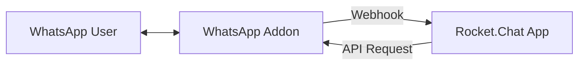

# 🚀 Rocket.Chat Bridge Guide

This guide describes how to connect your **Rocket.Chat** instance to WhatsApp using the WhatsApp Addon.

## 🏗️ Architecture

The integration works using a bi-directional bridge:

1.  **Incoming (WA → RC)**: The WhatsApp Addon sends a Webhook to the Rocket.Chat Private App.
2.  **Outgoing (RC → WA)**: The Rocket.Chat Private App sends an API request to the WhatsApp Addon.

---

## 🛠️ Step 1: Configure the WhatsApp Addon

1.  Open your **Home Assistant Settings** > **Add-ons** > **WhatsApp**.
2.  Go to the **Configuration** tab.
3.  Enable the Webhook and set a secure token:
    - **Webhook Enabled**: `true`
    - **Webhook URL**: `http://<YOUR_ROCKETCHAT_IP>:3000/api/apps/public/whatsapp-bridge-addon/webhook`
    - **Webhook Token**: `YourSecretTokenGoesHere` (Define a strong random string)
4.  **Restart** the Add-on.
5.  Check the Add-on **Web UI** and copy your **API Token** and **Port (8066)**.

---

## 📦 Step 1: Install Rocket.Chat Private App

1.  **Download the Bridge App**: [Download whatsapp-rocketchat-bridge.zip](https://raw.githubusercontent.com/FaserF/hassio-addons/refs/heads/master/whatsapp-rocketchat-bridge.zip)
2.  Log in to your **Rocket.Chat Administration**.
3.  Navigate to **Workspace** > **Apps**.
4.  Click **Upload App** and select the `.zip` file you downloaded.
5.  Click **Install**.

---

## ⚙️ Step 3: Configure the Bridge App

Once installed, click on the **WhatsApp Bridge** app to open its settings:

1.  **WhatsApp Addon URL**: Enter `http://<YOUR_HA_IP>:8066`
2.  **WhatsApp API Token**: Paste the token from the Addon Web UI.
3.  **Local Webhook Token**: Paste the **same** token you defined in the Addon Configuration (Step 1).
4.  **Target Room Name**: Enter the name of the room (e.g. `general` or a private channel) where WhatsApp messages should appear.
5.  Click **Save Changes**.

---

## 💬 How to Use

### Receiving Messages
Any incoming WhatsApp message will automatically appear in your configured Rocket.Chat channel:
> **[WA] 49123456789**: Hello from WhatsApp!

### Sending Messages
To send a message back to WhatsApp, prefix your message with the recipient's phone number in brackets:
> `[49123456789] Hello from Rocket.Chat!`

> **Tip:**
> You can also send messages to WhatsApp Groups by using the group JID (if you know it) or the group number from the logs.

---

## 🔐 Security Information

- **Double-Token Protection**: We use a unique token system to ensure only your specific Addon can post to your Rocket.Chat instance.
- **Internal Traffic**: If both services are on the same local network, no data ever leaves your home.
- **Privacy**: No external servers (except WhatsApp's own) are involved in processing your messages.
