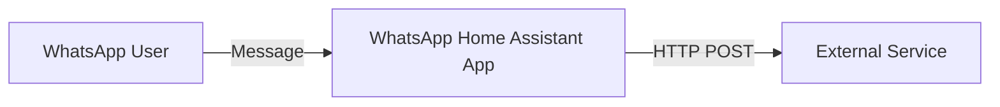

# 🔗 Webhook Support

The WhatsApp Home Assistant App includes a built-in Webhook feature that allows you to forward incoming messages to any external service in real-time. This is perfect for custom integrations, logging, or bridging to other chat platforms.

## 🚀 How it works

When the Webhook is enabled, the App sends a `POST` request to your configured URL for every incoming message.



---

## ⚙️ Configuration

1.  Navigate to **Settings** > **Apps** > **WhatsApp** in Home Assistant.
2.  Go to the **Configuration** tab.
3.  Fill in the following fields:

| Option              | Type     | Description                                                        |
| :------------------ | :------- | :----------------------------------------------------------------- |
| **Webhook Enabled** | `bool`   | Set to `true` to activate forwarding.                              |
| **Webhook URL**     | `string` | The full URL (including `http://` and port) of your destination.   |
| **Webhook Token**   | `string` | A secret string that will be sent in the `X-Webhook-Token` header. |

### 🔄 Dynamic Configuration

You can also change these settings dynamically using the **Start > Services** tab in Developer Tools or via automations:

```yaml
service: whatsapp.configure_webhook
data:
  url: 'https://my-new-url.com/api/webhook'
  enabled: true
  token: 'my-secret-token'
```

This is useful if your external URL changes (e.g., Nabu Casa URL) or you want to toggle the webhook based on conditions.

---

## 🔐 Security

To ensure that only your App can send data to your target service, we send the `X-Webhook-Token` header with every request. Your service should validate this token before processing the data.

```http
POST /your-endpoint HTTP/1.1
Content-Type: application/json
X-Webhook-Token: your_secret_token_here
```

---

## 📦 Payload Structure

The payload is a JSON object containing the sender and the message content:

```json
{
  "sender": "49123456789@s.whatsapp.net",
  "content": "Hello from WhatsApp!",
  "is_group": false,
  "raw": { ... }
}
```

- **sender**: The full WhatsApp JID of the sender.
- **content**: The text content of the message.
- **is_group**: `true` if the message came from a group.
- **raw**: The complete Baileys message object for advanced use cases.

---

## 🛋️ Built-in Bridges

Using this Webhook, you can easily connect to other platforms:

- **[Rocket.Chat Bridge](rocketchat.md)**: Our official guide for Rocket.Chat integration.

---

## 🛠️ Generic Examples

### 🐍 Python (Flask)

A simple receiver to log incoming messages:

```python
from flask import Flask, request, jsonify

app = Flask(__name__)

@app.route('/webhook', methods=['POST'])
def whatsapp_webhook():
    token = request.headers.get('X-Webhook-Token')
    if token != "your_secret_token_here":
        return "Unauthorized", 401

    data = request.json
    print(f"New message from {data['sender']}: {data['content']}")
    return jsonify({"status": "received"})

if __name__ == '__main__':
    app.run(port=5000)
```

### 🤖 Node-RED

1.  Add an **http in** node (Method: `POST`, URL: `/whatsapp`).
2.  (Optional) Add a **switch** node to check `msg.headers['x-webhook-token']`.
3.  Add a **debug** node to view the output (`msg.payload`).
4.  Process the data as needed using Home Assistant nodes or generic logic.
