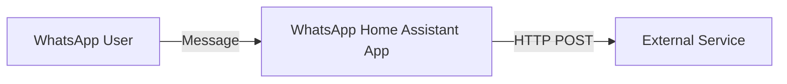

# 🔗 Webhook Support

The WhatsApp Home Assistant App includes a built-in Webhook feature that allows you to forward incoming messages to any external service in real-time. This is perfect for custom integrations, AI agents, n8n automation pipelines, logging, or bridging to other chat platforms.

## 🚀 How it works

When the Webhook is enabled, the App sends a `POST` request to your configured URL for every incoming message.


```mermaid
graph LR
    User[WhatsApp User] -- Message --> App[WhatsApp Home Assistant App]
    App -- HTTP POST --> Target[External Service]
```

---

## ⚙️ Configuration

1. Navigate to **Settings** > **Apps** > **WhatsApp** in Home Assistant.
2. Go to the **Configuration** tab.
3. Fill in the following fields:

| Option              | Type     | Description                                                        |
| :------------------ | :------- | :----------------------------------------------------------------- |
| **Webhook Enabled** | `bool`   | Set to `true` to activate forwarding.                              |
| **Webhook URL**     | `string` | The full URL (including `http://` and port) of your destination.   |
| **Webhook Token**   | `string` | A secret string that will be sent in the `X-Webhook-Token` header. |

### 🔄 Dynamic Configuration

You can also change these settings dynamically using the **Start > Services** tab in Developer Tools or via automations:

```yaml
service: whatsapp.configure_webhook
data:
  url: "https://my-new-url.com/api/webhook"
  enabled: true
  token: "my-secret-token"
```

Or via the REST API directly:

```http
POST http://<your-ha-ip>:8066/settings/webhook
X-Auth-Token: <your-token>
Content-Type: application/json

{ "url": "https://...", "enabled": true, "token": "my-secret" }
```

This is useful if your external URL changes (e.g., Nabu Casa URL) or you want to toggle the webhook based on conditions.

---

## 🔐 Security

To ensure that only your App can send data to your target service, we send the `X-Webhook-Token` header with every request. Your service should validate this token before processing the data.

```http
POST /your-endpoint HTTP/1.1
Content-Type: application/json
X-Webhook-Token: your_secret_token_here
```

---

## 📦 Payload Structure

The payload is a JSON object containing the complete event data for every incoming message:

```json
{
  "id": "BAE5CCF5A3B2...",
  "type": "text",
  "content": "Hello from WhatsApp!",
  "sender": "491761234567@s.whatsapp.net",
  "person_jid": "491761234567@s.whatsapp.net",
  "sender_name": "John Doe",
  "from": "491761234567@s.whatsapp.net",
  "sender_number": "491761234567",
  "is_group": false,
  "is_forwarded": false,
  "media_url": null,
  "media_path": null,
  "media_type": null,
  "media_mimetype": null,
  "caption": null,
  "is_admin": false,
  "is_group_admin": false,
  "session_id": "default",
  "vote": null,
  "raw": { "...": "full Baileys message object" }
}
```

### Field Reference

| Field | Type | Description |
| :---- | :--- | :---------- |
| `id` | `string` | Unique WhatsApp message ID |
| `type` | `string` | Message type: `text`, `image`, `video`, `audio`, `document`, `sticker`, `location`, `poll`, `poll_update`, `button_reply`, `list_reply`, `event` |
| `content` | `string\|null` | Text content of the message (or transcribed STT text for voice notes if configured) |
| `sender` | `string` | Full WhatsApp JID of the sender |
| `person_jid` | `string` | JID of the actual person (differs from `sender` in group messages) |
| `sender_name` | `string` | Display name / push name of the sender |
| `from` | `string` | JID of the chat the message arrived in (group JID for groups, person JID for DMs) |
| `sender_number` | `string` | Plain phone number without `+` or spaces (e.g. `491761234567`) |
| `is_group` | `bool` | `true` if the message came from a group chat |
| `is_forwarded` | `bool` | `true` if the message was forwarded |
| `media_url` | `string\|null` | Public URL of received media file (image, video, document, audio) |
| `media_path` | `string\|null` | Local file path on the addon container (if media folder is configured) |
| `media_type` | `string\|null` | Media category: `image`, `video`, `audio`, `document`, `sticker` |
| `media_mimetype` | `string\|null` | MIME type of the media (e.g. `image/jpeg`, `audio/ogg; codecs=opus`) |
| `caption` | `string\|null` | Caption text accompanying media messages |
| `is_admin` | `bool` | `true` if sender is in the configured `admin_numbers` list |
| `is_group_admin` | `bool` | `true` if sender is a WhatsApp group admin (only applies in groups) |
| `session_id` | `string` | Session identifier (useful for multi-instance setups) |
| `vote` | `object\|null` | Poll vote data (only present for `poll_update` type) |
| `raw` | `object` | Complete raw Baileys message object for advanced use cases |

---

## 🛋️ Built-in Bridges

Using this Webhook, you can easily connect to other platforms:

- **[n8n Integration](n8n.md)**: Step-by-step guide to connect with n8n workflows (send + receive).
- **[Rocket.Chat Bridge](rocketchat.md)**: Our official guide for Rocket.Chat integration.

---

## 🛠️ Generic Examples

### 🐍 Python (Flask)

A simple receiver to log incoming messages:

```python
from flask import Flask, request, jsonify

app = Flask(__name__)


@app.route("/webhook", methods=["POST"])
def whatsapp_webhook():
    token = request.headers.get("X-Webhook-Token")
    if token != "your_secret_token_here":
        return "Unauthorized", 401

    data = request.json
    msg_type = data.get("type", "unknown")
    sender = data.get("sender_number")
    content = data.get("content") or f"[{msg_type}]"
    print(f"New message from {sender} ({msg_type}): {content}")
    return jsonify({"status": "received"})


if __name__ == "__main__":
    app.run(port=5000)
```

### 🤖 Node-RED

1. Add an **http in** node (Method: `POST`, URL: `/whatsapp`).
2. (Optional) Add a **switch** node to check `msg.headers['x-webhook-token']`.
3. Add a **debug** node to view the output (`msg.payload`).
4. Process the data as needed using Home Assistant nodes or generic logic.

### 🔄 n8n

See the dedicated **[n8n Integration](n8n.md)** guide for a complete walkthrough including sending, receiving, AI agent patterns, and expression reference.

