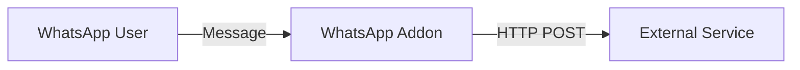

# 🔗 Webhook Support

The WhatsApp Addon includes a built-in Webhook feature that allows you to forward incoming messages to any external service in real-time. This is perfect for custom integrations, logging, or bridging to other chat platforms.

## 🚀 How it works

When the Webhook is enabled, the Addon sends a `POST` request to your configured URL for every incoming message.



---

## ⚙️ Configuration

1.  Navigate to **Settings** > **Add-ons** > **WhatsApp** in Home Assistant.
2.  Go to the **Configuration** tab.
3.  Fill in the following fields:

| Option | Type | Description |
| :--- | :--- | :--- |
| **Webhook Enabled** | `bool` | Set to `true` to activate forwarding. |
| **Webhook URL** | `string` | The full URL (including `http://` and port) of your destination. |
| **Webhook Token** | `string` | A secret string that will be sent in the `X-Webhook-Token` header. |

---

## 🔐 Security

To ensure that only your Addon can send data to your target service, we send the `X-Webhook-Token` header with every request. Your service should validate this token before processing the data.

```http
POST /your-endpoint HTTP/1.1
Content-Type: application/json
X-Webhook-Token: your_secret_token_here
```

---

## 📦 Payload Structure

The payload is a JSON object containing the sender and the message content:

```json
{
  "sender": "49123456789@s.whatsapp.net",
  "content": "Hello from WhatsApp!",
  "is_group": false,
  "raw": { ... }
}
```

- **sender**: The full WhatsApp JID of the sender.
- **content**: The text content of the message.
- **is_group**: `true` if the message came from a group.
- **raw**: The complete Baileys message object for advanced use cases.

---

## 🛋️ Built-in Bridges

Using this Webhook, you can easily connect to other platforms:
- **[Rocket.Chat Bridge](rocketchat.md)**: Our official guide for Rocket.Chat integration.
